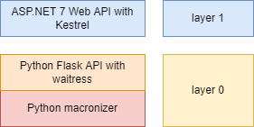

# Macronizer API

This API wraps the [Alatius macronizer API service](https://github.com/Myrmex/alatius-macronizer-api) into a more robust, open infrastructure to be consumed by web clients.

- [Macronizer API](#macronizer-api)
  - [Features](#features)
  - [Architecture](#architecture)
  - [Usage](#usage)
  - [Settings](#settings)
    - [Auditing](#auditing)
    - [Network](#network)
  - [CLI Tool](#cli-tool)

## Features

- CORS-enabled, JSON-based API endpoint to macronize Latin texts using the Alatius macronizer engine (ASP.NET 7).
- auditing features like logging and optional mailing to administrators.
- rate limiting policy to prevent issues and DoS attacks. This is especially required here because of the low performance due to the Python-based core.
- some additional filtering functions for preprocessing input text and postprocessing output text.
- fully containerized distribution (Docker), making the tool usable both in a local machine for single users, and in a server.

## Architecture

The diagram below shows the layers in this architecture:



1. at the bottom there is the Python macronizer, compiled with some adjustments from [Alatius macronizer](https://github.com/Alatius/latin-macronizer).
2. on top of it, a thin [Flask API](https://github.com/Myrmex/alatius-macronizer-api) provides macronizer functionality as a service.
3. on top of the Flask API, the ASP.NET web API provides a more robust infrastructure, and some additional filtering services.

Services 1-2 are packed in a Docker image (`vedph2020/macronizer:0.0.4-alpha` and above), while service 3 is packed in a different image (`vedph2020/macronizer-api:0.0.1` and above).

The API is designed to provide base macronization services for moderate machine consumption, as this is just a wrapper around a Python-based core, whose performance is the weak link in the chain. So, it mainly targets occasional usages, and provides a number of mechanism to protect server resources from abuse:

- text size is limited to max 50,000 characters.
- the rate of requests per time frame is limited.
- auditing mechanisms are in place to allow admins fine tune the API parameters for best results.

Should you need exclusive access to the service, it is recommended to run it on your local machine, using the provided [Docker compose script](docker-compose.yml), or just drop the whole layer 1 and directly consume layer 0 by running a container from the macronizer image (unless you need the additional filtering services of layer 1, which anyway are trivial).

Additionally, this solution also provides a minimalist CLI tool application, used to stress-test the API and verify its rate limit functionality.

⚙️ Quick **Docker** image build: `docker build . -t vedph2020/macronizer-api:0.0.1 -t vedph2020/macronizer-api:latest` (replace with the current version).

## Usage

Apart from endpoints used for diagnostic purposes, the API exposes a single endpoint for the macronization service, `api/macronize`, for a POST request whose body corresponds to a JSON object having this model (\* marks required properties):

- `text` (string)\*: the text to macronize. Max 50,000 characters.
- `maius` (boolean): true to macronize capitalized words.
- `utov` (boolean): true to convert U to V.
- `itoj` (boolean): true to convert I to J.
- `ambiguous` (boolean): true to mark ambiguous results. In this case, the output will be HTML instead of plain text, with `span` elements wrapping each word, with a `class` attribute equal to `ambig` or `unknown` (or `auto` for unmarked vowels). In turn, each of these spans will wrap the vowels inside an attribute-less span `element`. You can use the options below to convert it before returning the result.
- `normalizeWS` (boolean): true to normalize whitespace in text before macronization. This normalizes space/tab characters by replacing them with a single space, and trimming the text at both edges. It also normalizes CR+LF into LF only.
- `precomposeMN` (boolean): true to to apply Mn-category Unicode characters precomposition before macronization. This precomposes Unicode Mn-category characters with their letters wherever possible. Apply this filter when the input text has Mn-characters to avoid potential issues with macronization.
- `unmarkedEscapeOpen` (string): the optional opening escape to use for an unmarked-form vowel.
- `unmarkedEscapeClose` (string): the optional closing escape to use for an unmarked-form vowel.
- `ambiguousEscapeOpen` (string): the optional opening escape to use for an ambiguous-form vowel.
- `ambiguousEscapeOpen` (string): the optional closing escape to use for an ambiguous-form vowel.
- `unknownEscapeOpen` (string): the optional opening escape to use for an unknown-form vowel.
- `unknownEscapeClose` (string): the optional closing escape to use for an unknown-form vowel.

The result is a JSON object having this model:

- `result` (string): text. When set, there is no `error`.
- `error` (string): error. When set, there is no `result`.
- `maius` (boolean): true to macronize capitalized words.
- `utov` (boolean): true to convert U to V.
- `itoj` (boolean): true to convert I to J.
- `ambiguous` (boolean): true to mark ambiguous results.

For instance, from this request _body_:

```json
{
  "ambiguous": true,
  "text": "Gallia est omnis divisa in partes tres, quarum unam incolunt Belgae, aliam Aquitani, tertiam qui ipsorum lingua Celtae, nostra Galli appellantur."
}
```

you get this response _content_:

```json
{
  "result": "<span class=\"ambig\">G<span>a</span>ll<span>i</span><span>ā</span></span> <span class=\"ambig\"><span>e</span>st</span> <span class=\"ambig\"><span>o</span>mn<span>ī</span>s</span> <span class=\"ambig\">d<span>ī</span>v<span>ī</span>s<span>a</span></span> <span class=\"auto\"><span>i</span>n</span> <span class=\"auto\">p<span>a</span>rt<span>ē</span>s</span> <span class=\"auto\">tr<span>ē</span>s</span>, <span class=\"auto\">q<span>u</span><span>ā</span>r<span>u</span>m</span> <span class=\"auto\"><span>ū</span>n<span>a</span>m</span> <span class=\"auto\"><span>i</span>nc<span>o</span>l<span>u</span>nt</span> <span class=\"auto\">B<span>e</span>lg<span>a</span><span>e</span></span>, <span class=\"auto\"><span>a</span>l<span>i</span><span>a</span>m</span> <span class=\"auto\"><span>A</span>q<span>u</span><span>ī</span>t<span>ā</span>n<span>ī</span></span>, <span class=\"auto\">t<span>e</span>rt<span>i</span><span>a</span>m</span> <span class=\"auto\">q<span>u</span><span>ī</span></span> <span class=\"auto\"><span>i</span>ps<span>ō</span>r<span>u</span>m</span> <span class=\"ambig\">l<span>i</span>ng<span>u</span><span>ā</span></span> <span class=\"auto\">C<span>e</span>lt<span>a</span><span>e</span></span>, <span class=\"ambig\">n<span>o</span>str<span>a</span></span> <span class=\"auto\">G<span>a</span>ll<span>ī</span></span> <span class=\"auto\"><span>a</span>pp<span>e</span>ll<span>a</span>nt<span>u</span>r</span>.",
  "error": null,
  "maius": false,
  "utov": false,
  "itoj": false,
  "ambiguous": true
}
```

Using the "escape" properties allows you to convert HTML output into something else, e.g. a compact plain text with some conventional characters reserved to annotate ambiguous or unknown words. For instance, setting these properties will append `¿` to ambiguous word vowels, and `¡` to unknown word vowels, stripping any HTML markup out:

```json
{
    "ambiguous": true,
    "unmarkedEscapeOpen": "",
    "unmarkedEscapeClose": "",
    "ambiguousEscapeOpen": "",
    "ambiguousEscapeClose": "¿",
    "unknownEscapeOpen": "",
    "unknownEscapeClose": "¡"
}
```

In this case, the output will be more compact:

```json
{
  "result": "Ga¿lli¿ā¿ e¿st o¿mnī¿s dī¿vī¿sa¿ in partēs trēs, quārum ūnam incolunt Belgae, aliam Aquītānī, tertiam quī ipsōrum li¿ngu¿ā¿ Celtae, no¿stra¿ Gallī appellantur.",
  "error": null,
  "maius": false,
  "utov": false,
  "itoj": false,
  "ambiguous": true
}
```

As you can define the opening and closing string for each type of vowel length rank, you can customize the output as you fit, should you want to avoid the default HTML based on nested `span`'s.

## Settings

All these settings can be overridden, usually via environment variables in the Docker compose script.

### Auditing

- `Diagnostics/IsTestEnabled`: enable or disable the API test functions.
- `Mailer`:
  - `IsEnabled`: true to enable mailing.
  - `SenderEmail`: the address to use as the email sender address.
  - `SenderName`: the name to use as the email sender address.
  - `Host`: the URI of the SMTP server.
  - `Port`: the SMTP server's port.
  - `UseSsl`: true to use SSL when connecting to the SMTP server.
  - `UserName`: the SMTP user name.
  - `Password`: the SMTP user password.
  - `Recipients`: the recipient(s) of notification email messages. This is an array of strings.
  - `TestRecipient`: the email address to use as the recipient for a test email message.
- `Messaging`:
  - `AppName`: the name of the app written in a text message.
  - `ApiRootUrl`: the root URL of the app eventually written in a text message.
  - `AppRootUrl`: the root URL of the app frontend eventually written in a text message.
  - `SupportEmail`: the email address for contacting support eventually written in a text message.
- `Serilog/RollingInterval`: the rolling interval for the API log file. Valid values are: `Infinite`, `Year`, `Month`, `Day` (default), `Hour`, `Minute`.

### Network

- `AlatiusMacronizerUri`: the URI of the macronizer service. Default is `http://localhost:51234/` as this is inside the Docker compose stack network.
- `MacronizerTimeout`: the timeout for the wrapped macronizer service, in minutes. Default is 3.
- `RateLimit`:
  - `IsDisabled`: true to disable rate limiting.
  - `PermitLimit`: the maximum number of requests per time window. Default is 10.
  - `QueueLimit`: the queue limit. Default is 0.
  - `Window`: the time window, usually with format `HH:MM:SS`. Any `TimeSpan`-parsable string can be used. Default is 1 minute, which together with `PermitLimit`=10 means max 10 requests per minute.

## CLI Tool

The CLI tool currently has the only function of stress-testing the API to verify its rate limiting capabilities. You might also concatenate `curl` requests in a single bash line, or do other tricks; but this is easier. Tools like Postman are not able to do multiple parallel requests (as they are Electron, and thus NodeJS-based).

To this end, the tool has a single command, `stress`, with this syntax:

```bash
./macron stress [-t Text] [-c RequestCount] [-m Timeout] [-p]
```

where:

- `-t` is the text to macronize (include it in `""`). Omit this to use a default text (the incipit of _bellum Gallicum_).
- `-c` is the count of requests to be made (default 20).
- `-m` is the timeout, in minutes, for each request (default 5).
- `-p` to process the requests in parallel, each with its own client, rather than in sequence, with a single client (default `false`).

Sample:

```bash
./macron stress -p -c 11
```
